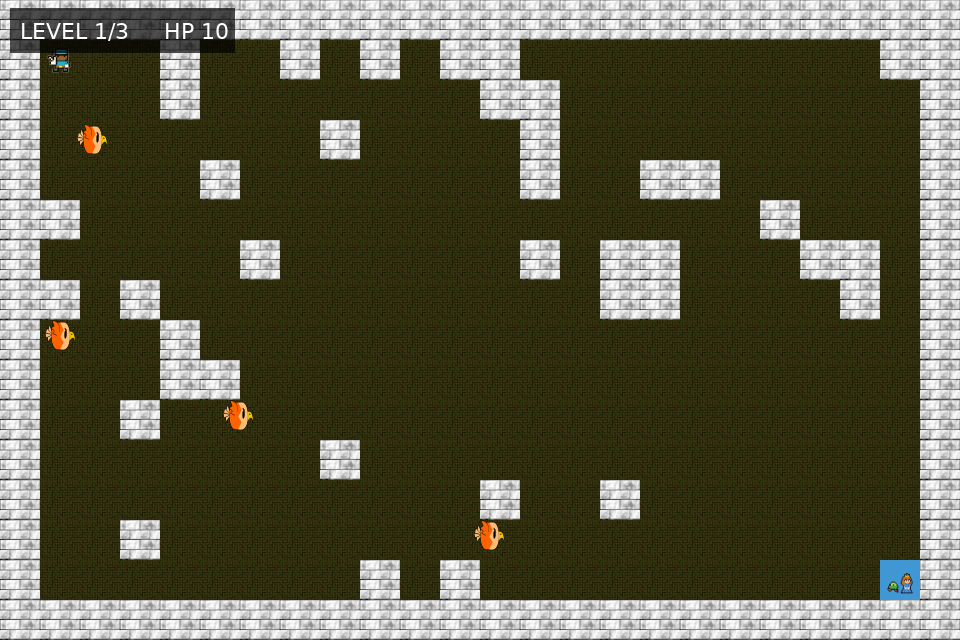

# Dungeon Quest

Dungeon Quest is a compact top-down arcade game developed in Python with Pygame. The player explores procedurally generated dungeon maps, avoids pursuing enemies, fires directional projectiles, and reaches the goal across three increasingly difficult levels.



## Gameplay features

- Three progressive levels with denser procedural maps
- Solvable map generation with automatic route validation
- Real-time keyboard movement and collision detection
- Enemy pursuit behavior and health-based combat
- Directional projectile system
- Moving wall hazards in the final level
- Win, game-over, and restart states

## Controls

| Key | Action |
| --- | --- |
| Arrow keys | Move the player |
| Space | Fire in the current direction |
| R | Restart the game |
| Esc | Quit |

## Run locally

Requirements: Python 3.10 or newer.

1. Clone the repository:

   ```bash
   git clone https://github.com/YOUR-USERNAME/pygame-dungeon-quest.git
   cd pygame-dungeon-quest
   ```

2. Create and activate a virtual environment:

   ```bash
   python -m venv .venv
   ```

   Windows PowerShell:

   ```powershell
   .venv\Scripts\Activate.ps1
   ```

   macOS or Linux:

   ```bash
   source .venv/bin/activate
   ```

3. Install the dependency and start the game:

   ```bash
   python -m pip install -r requirements.txt
   python main.py
   ```

## Project structure

```text
pygame-dungeon-quest/
├── assets/              # Character, environment, goal, and projectile sprites
├── docs/                # Gameplay screenshot used in this README
├── tests/               # Automated map-generation tests
├── game.py              # Game state, mechanics, rendering, and procedural map logic
├── main.py              # Application entry point
├── requirements.txt     # Python dependency
└── README.md            # Project documentation
```

## Technical focus

This project demonstrates real-time game-loop design, keyboard event handling, 2D collision detection, grid-based procedural generation, simple pursuit AI, projectile lifecycle management, and structured state transitions using Pygame.

## Test the level generator

```bash
python -m unittest discover -s tests -v
```

The tests verify that generated maps remain solvable, boundary walls stay intact, and the start and goal cells remain accessible.

## Possible next steps

- Add sprite animation and audio feedback
- Introduce collectible treasure and a scoring system
- Add pathfinding for more advanced enemy navigation
- Create hand-designed boss encounters and difficulty settings
- Package the game as a desktop executable

## Author

**Tinhinene Boumerdassi**  
Embedded Systems & Electronics Engineer  
[Portfolio](https://tina-boumerdassi-portfolio.framer.website/)
